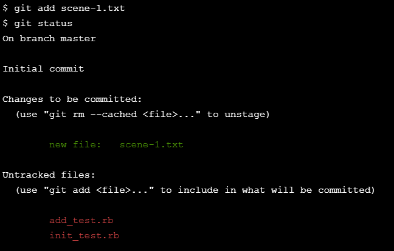

<h1>Lesson: Basic Git Workflow</h1>

# Section 1
Hello Git
Git is a software that allows you to keep track of changes made to a project over time. Git works by recording the changes you make to a project, storing those changes, then allowing you to reference them as needed.

We’ll learn Git by using it to help us write a screenplay called Harry Programmer and the Sorcerer’s Code.

We’ll get started by taking a look at the screenplay project.

In scene-1.txt, add this text:

Harry Programmer and the Sorcerer’s Code: Scene 1
Then press enter to create a new empty line. Once you’ve created the new line, click Run.

# Section 2
git init
Now that we have started working on the screenplay, let’s turn the sorcerers-code directory into a Git project. We do this with:

git init
The word init means initialize. The command sets up all the tools Git needs to begin tracking changes made to the project.

In the terminal, initialize a new Git project.

Notice the output:

Initalized empty Git repository in /home/ccuser/workspace/sorcerers-code/.git/
The Git project was created. Click Next to continue.

# Section 3

BASIC GIT WORKFLOW
Git Workflow
Nice! We have a Git project. A Git project can be thought of as having three parts:

1. A Working Directory: where you’ll be doing all the work: creating, editing, deleting and organizing files
2. A Staging Area: where you’ll list changes you make to the working directory
3. A Repository: where Git permanently stores those changes as different versions of the project

The Git workflow consists of editing files in the working directory, adding files to the staging area, and saving changes to a Git repository. In Git, we save changes with a commit, which we will learn more about in this lesson.

Take a look at the diagram. Before we move on, it will help to be familiar with the three parts of the Git workflow. Click Next to continue.

<!--  -->

# Section 4

git status
As you write the screenplay, you will be changing the contents of the working directory. You can check the status of those changes with:

git status
Instructions
1.
From the terminal, check the status of the sorcerers-code project.

In the output, notice the file in red under untracked files. Untracked means that Git sees the file but has not started tracking changes yet.

