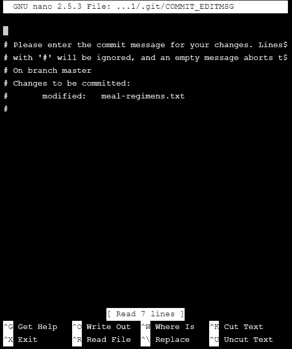

# Manhattan Zoo
Manhattan Zoo
Ready to try out some of your new Git knowledge?

In this project, you’ll use Git to keep track of meal guidelines for animals at the Manhattan Zoo.

If you get stuck during this project or would like to see an experienced developer work through it, click “Get Unstuck“ to see a project walkthrough video.

Manhattan Zoo
# Task 1.
Initialize a new Git repository.

# Task 2.
Check the status of the repository.

# Task 3.
Add meal-regimens.txt to the staging area.

# Task 4.
Make a commit.

# Task 5.
Include this new info in meal-regimens.txt.

1. Long-Tailed Chinchillas
Meal: 1 bag animal pellets, 1 bag dried fruit, 1/2 bag cashews, 5 carrots, 3 stalks kale
Times: 8:00 am
Directions: disperse contents throughout Chinchilla habitat
Click Save.

# Task 6.
Add meal-regimens.txt to the staging area.

# Task 7.
Check the status of the Git project.

You should see meal-regimens.txt listed as “modified”.

# Task 8.
Make a commit.

# Task 9.
View your Git commit history.

If your cursor is stuck in Git log mode, press “q” on your keyboard to escape.

# Task 10.
Here’s two more animal reports. Include each in meal-regimens.txt, making a new commit for each animal added.

1. Poison Dart Frogs
Meal: 1 bag small crickets
Times: 6:00 am
Directions: empty bag in frog habitat once daily. Do not touch frogs! Extremely poisonous.
 
5. Western Lowland Gorilla
Meal: (Morning) 20 lbs. kale, 10 lbs. celery, 10 lbs. green beans, 5 lbs. carrots, 1 bag sweet potatoes. (Evening) 10 Bananas, 10 apples, 5 oranges, 5 mango, 20 lbs. grapes, 10 lbs. turnips, 5 lbs. white potatoes
Times: 6:30 am, 12:00 pm, 7:00 pm
Directions: feed Gorillas in the morning as group, spread forage items during noon meal, and divide quantities for individual feeding in evening

