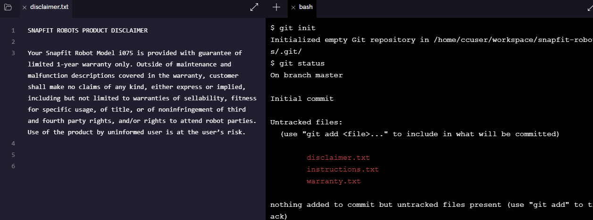
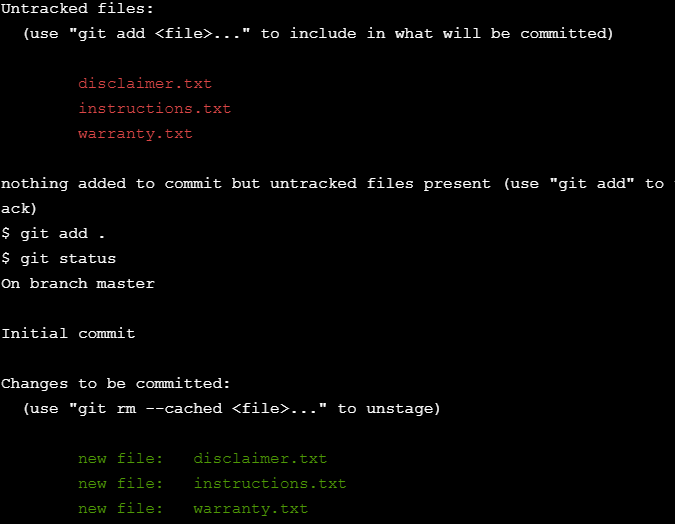
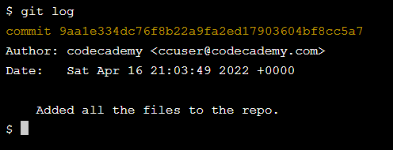
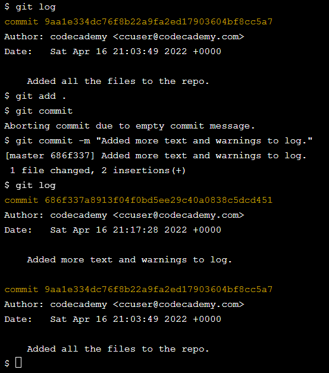
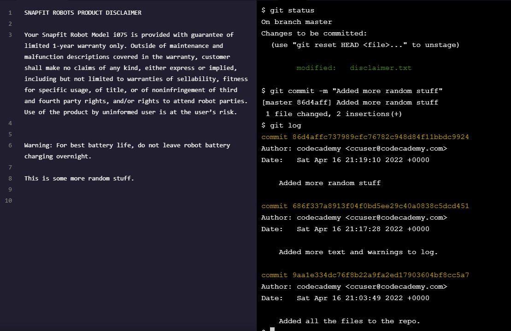

# SnapFit Robots, Inc.
Now that you’ve had more practice with the Git workflow, let’s solidify your new skills even more.

In this project, you will be working on assembly instructions for Snap-Fit Robots Inc., a build-it-yourself robot company.

If you get stuck during this project or would like to see an experienced developer work through it, click “Get Unstuck“ to see a project walkthrough video.

# Key Concepts
To complete this project, you'll need to be familiar with:
* Git
* Working Directory
* Staging Area
* Repository

# 1. Initialize a new Git project.

# 2. Check the status of the Git project.

You will see multiple files listed in the output as “Untracked”.

# 3. Add each file to the Git staging area.

<strong> Note: using "git add ." rather than "git add disclaimer.txt", "git add instruction.txt" etc, will add all the files to the staging area.
</strong>

# 4. Check the status of the Git project again.

# 5. Make a commit.

# 6. View your Git commit log.

If your cursor is stuck in Git log mode, press “q” on your keyboard to escape.

# 7. Include this line in disclaimer.txt:

Warning: For best battery life, do not leave robot battery charging overnight.
Click Save.

# 8. Add the file to the staging area.

# 9. Now make a commit.

# 10. View your Git commit log again to identify your commit.

# 11. Revise each file in whatever ways you’d like. Then add your changes to the staging area and make another commit.
