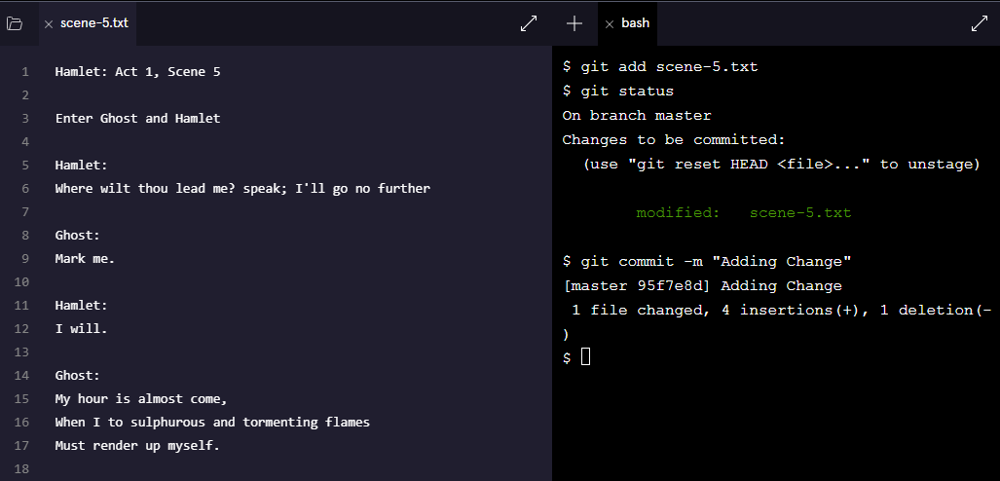

# 1. Backtracking Intro

Backtracking Intro
When working on a Git project, sometimes we make changes that we want to get rid of. Git offers a few eraser-like features that allow us to undo mistakes during project creation. In this lesson, we’ll learn some of these features.

To start out, let’s review the basic Git workflow.

1. You are in a Git project titled hamlet-prince-of-denmark. In the code editor, you’ll be working on scene-5.txt. Here, Hamlet encounters the ghost of his father. Add this text to the file:
```
Ghost: 
My hour is almost come,
When I to sulphurous and tormenting flames
Must render up myself.
```
2. From the terminal, add scene-5.txt to the staging area.

3. Commit the changes to the repository with a good commit message

